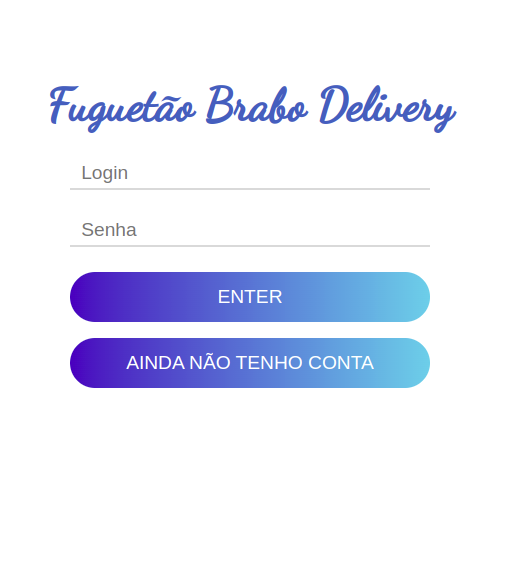

# Bem-vindo ao App de delivery
A App de delivery é uma aplicação full-stack desenvolvida em React e Node.js, produzida em grupo com a proposta de ser um e-commerce semelhante ao iFood. Nesta aplicação, é oferecido acesso para clientes, vendedores e administradores. Essas três funções definem o que será exibido ou acessado pelo front-end. Após logar como cliente, será possível adicionar, remover e finalizar o pedido. Após finalizar o pedido, ele será definido como pendente, aguardando a atualização do vendedor para o status "Preparando", depois atualizado para "Em Trânsito" e, novamente no cliente, atualizado como entregue. Todas as fases do processo podem ser vistas abrindo dois navegadores, sendo um deles anônimo.

 
</details>

## Sumário
- [Bem-vindo ao Api de delivery](#Bem-vindo-ao-App-de-delivery)
- [Preview](#preview)
- [Contexto](#contexto)
- [Tecnologias e Ferramentas Utilizadas](#tecnologias-e-ferramentas-utilizadas)
- [Instalação e Execução](#instalação-e-execução)
- [Notas](#notas)
 - [Git, GitHub e Histórico de Commits](#git-github-e-histórico-de-commits)
 - [Lint](#lint)
 
## Preview

**Visualização:**




## Contexto
O __App-De-Delivery__ é uma ferramenta que acessa a bases de dados, é permite aos usuários:
- Fazer login;
- Buscar por bebidas;
- Visualizar detalhes do pedido;
- Atualizar o status do pedido;

### Quando administrador

- É possivel cadastrar vendedores e clientes;

## Tecnologias e Ferramentas Utilizadas

Este projeto utiliza as seguintes tecnologias e ferramentas:

- [React.js](https://reactjs.org/docs/getting-started.html) | Biblioteca para criar interfaces de usuário.
- [CSS]((https://developer.mozilla.org/pt-BR/docs/Web/CSS)) | Linguagem de estilo.
- [Context API](https://pt-br.reactjs.org/docs/context.html) | API utilizada para gerenciamento de estado.
- [Trello](https://trello.com/) | Ferramenta de gerenciamento de tarefas.

O React.js foi escolhido por ser uma das bibliotecas mais populares e amplamente utilizadas para criar interfaces de usuário. Além disso, o React.js é fácil de aprender e possui uma grande comunidade de desenvolvedores, o que torna mais fácil encontrar soluções para problemas comuns. A Context API foi utilizada para gerenciamento de estado, permitindo que informações importantes da aplicação sejam compartilhadas entre diferentes componentes, sem a necessidade de passá-las manualmente através de props. Isso torna o código mais limpo e fácil de entender. O Trello foi utilizado para gerenciamento de tarefas, seguindo metodologias ágeis durante o desenvolvimento. O Node.js foi incorporado para padronizar a linguagem tanto no front-end quanto no back-end e obter os benefícios da escalabilidade e eficiência, pois ele é capaz de lidar com vários tráfegos sem bloqueio e lida com solicitações com baixo consumo de recursos.

## Instalação e Execução
### Download do projeto
```
git clone git@github.com:JonathanProjetos/App-De-Delivery.git
```
### Instalar dependências
```
cd App-De-Delivery
npm install
npm start
```
### Evn
- Dentro da pasta back-end existe o arquivo .env.example nele será nescessário oferecer a senha do seu mysql.

## Notas
A aplicação foi desenvolvida utilizando o conceito de __mobile first__, ou seja, a interface foi projetada primeiramente para dispositivos móveis.

### Git, GitHub e Histórico de Commits
Este projeto utilizou a [Especificação de Commits Convencionais](https://www.conventionalcommits.org/en/v1.0.0/), com alguns tipos da [convenção Angular](https://github.com/angular/angular/blob/22b96b9/CONTRIBUTING.md#-commit-message-guidelines). Além disso, foi utilizado o pacote [conventional-commit-cli](https://www.npmjs.com/package/conventional-commit-cli) para ajudar a seguir a convenção de commits. É importante utilizar a convenção de commits em projetos para manter o histórico de commits organizado e facilitar a leitura e o entendimento do que foi desenvolvido.

No desenvolvimento da aplicação foi realizado utilizando o Git para controle de versão e o GitHub como repositório remoto. Foram criadas branches para cada funcionalidade implementada e, posteriormente, mergeadas à branch principal.

### Metodologias Ágeis
Durante o desenvolvimento deste projeto, foram utilizadas metodologias ágeis, que são práticas que valorizam a interação e colaboração entre os membros de uma equipe de desenvolvimento, visando uma entrega mais rápida e eficiente do projeto. A utilização dessas práticas é especialmente importante em projetos em grupo, pois ajuda a manter a equipe alinhada e a evitar atrasos e retrabalhos desnecessários. Para saber mais sobre as metodologias ágeis, confira o [Manifesto Ágil](https://agilemanifesto.org/).

### Lint
- O projeto foi desenvolvido seguindo os padrões de Clean Code especificados pelo [Lint da Trybe](https://github.com/betrybe/eslint-config-trybe).

